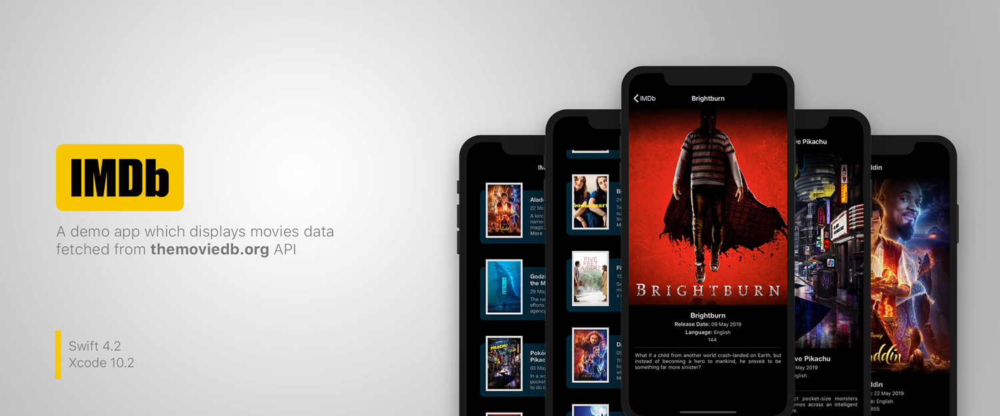

[Movies]

# IMDb-demo

## Development
- Swift 4.2
- XCode 10.2

## Getting Started
To run this project for development or debugging purposes, please follow the instruction below. The app is written on Swift 4.2 on Xcode 10.2

### Prerequisites
Make sure you have CocoaPods installed. You can install it by running this command on Terminal.
```
$ sudo gem install cocoapods
```
See [Getting Started on CocoaPods](https://guides.cocoapods.org/using/getting-started.html) for more informaiton.


### Installation 
- Open Terminal and head over to your project directory. After that, run the following command to install pods:
```
$ pod install
```
- Navigate to project directory and open workspace using *IMDB.xcworkspace*
- Build and run the application on simulator or actual device running iOS 10.0 or later using Xcode 10.x

## Features
- Upcoming movies information.
- Endless Scroll (Pagination based on themoviedb.org api data)
- Movie details (e.g. Poster, Rating, Language, Release Date, Overview)


## Technical Notes

### Architecture
- The architecture of this app is based on MVVM along with Builder and Coordinator.
- Builder is used for modules construction.
- Coordinator is used for navigation.
- Closures are used for ViewModels to View bindings.

### Code Structure
Code has been strucutred into two main categories, Sources and Resources:
- Sources contain all code files, views, extensions, business logic, etc.
- Resources contains Assets, Fonts, etc.

### Code Coverage
- Test cases for each module, logic and services are provided.
- Code Coverage is upto 79%.
- Find code coverage screenshot below. 

### Third Party
- Kingfisher (For downloading and caching images)
- SVProgressHUD (For displaying loader)

## Built With

* [CocoaPods](https://cocoapods.org/) - Dependency Management

## Versioning

Version 1.0
For more information on versioning, see [Semantic Versioning](http://semver.org/).

## Authors

* **Muhammad Abdul Subhan** - (https://github.com/mabdulsubhan)

## License

This project is licensed under the MIT License - see the [LICENSE.md](LICENSE.md) file for details


